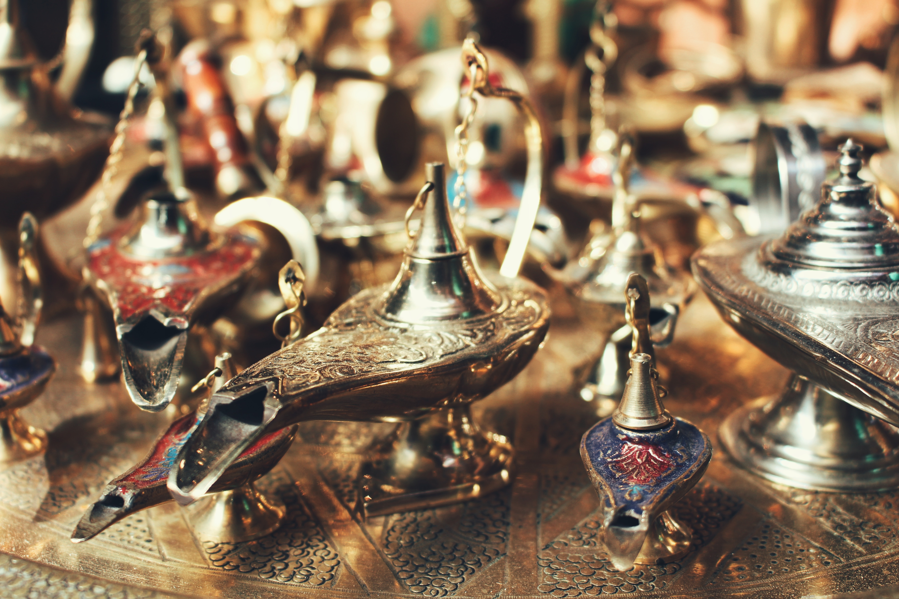

O‘rta asrlarda ilm-fan gullab-yashnagan **Buxoro va uning atrofidagi** eng qadimgi *shaharlaridan* biri bo‘lgan Nurning “Nuri Buxoro” deb atalishi bejiz emas. XX asr oxirlarida shaharda 32 ta masjid, chashma majmuasida madrasa va xonaqohlar bo‘lganligini mahalliy xalq hozir ham eslaydi. Ko‘pincha, masjidlar o‘zlaridan qadimiyroq me’moriy obidalar ustiga qurilgan. Eskirgan, buzilib ketgan masjid o‘rniga yangisi qurilavergan. Ammo masjidning eski nomi saqlanib qolgan.

Nurotalik keksa otaxonlardan F.Bahromov va A.Samadov ushbu masjidlar nomini sanab berdi:

##### Arabguzar masjidlari

1. Sayidato masjid.
2. Chuqurak masjid.
3. Masjidi Safed.
4. Shakarak masjid.
5. Bargso‘z masjid.
6. Hovuzak masjid
 

##### O‘rta guzar masjidlari

1. Domalla masjid.
2. Kaltako‘cha masjid.
3. Turko masjid.
4. Sodiq masjid.
5. Qulmahmad masjid.
6. Mozori chilla masjid.
7. Bo‘diq masjid.
 

##### Mirishkor guzar masjidlari

1. Duoba masjid.
2. Doston masjid.
3. Luchchak masjid.
4. Osiyoibaland masjid.
5. Mirishkor masjid.

##### Rabotto‘lg‘on guzar masjidlari

* Qo‘rg‘on masjid.
* Yetimcha masjid.
* Dasht masjid.
* Xo‘ja masjid.
* Avezxo‘ja masjid.
* Sariosiyo masjid.
* Rabotto‘lg‘on masjid.
* Lo‘la masjid.

Shahardagi guzar masjidi  nomlari asosan mahallalar nomlari bilan bir xil bo‘lgan. Masalan, Domalla masjid -­- Domalla mahallasi, Sayidato masjid  Sayidato mahallasi, Doston masjid -­- Doston mahallasi va  hokazo. Yuqoridagi masjidlarning qariyb hammasi buzilib ketgan. Faqatgina shahardagi “Chilustun” jome masjidi, “Panjvaqta” Katta Gumbaz masjidi, Domalla, Sayidato, Bargso‘z, Oqmachit kabi masjidlar kutubxona, mahalla idoralariga aylantirilganligi sababli saqlanib qolgan va hozirgi kunda namozxonlar ixtiyoriga berildi. Mustaqillik yillarida shahardagi tashabbuskor ziyolilar sa’y-harakati bilan Bo‘diq hamda Osiyoibaland masjidlari eski o‘rnida yana qad ko‘tardi.

Shahardagi | guzar | masjidi
- | - | -
nomlari | asosan | mahallalar
nomlari | bilan | bir xil
bo'lgan | masalan | domalla masjid

Asrimiz boshida Nurotada masjidlar sonining ko‘pligi xalqimizning madaniyati yuqori, e’tiqodi mustahkam bo‘lganligining nishonasidir. Birgina Domalla va Sayidato mahallasida 1920 yillarda mullo Asatillo, so‘fi Rahmonqul Hoji mufti, domullo Hoji, mullo Abduqahhor, mullo Rayimqul, qori Haqberdi, mullo Mahmarajab, mullo Rahmonberdi, so‘fi Tolib, mullo Shokirota, mullo Rahmonqul, mullo Suponqul, mullo Eshonqul, mullo Yorqul, qori Mahmud, mullo Bobo, mirzo Karomatillo, mullo Supon, boboi Xatib, hoji Cho‘li, hoji Nosir, qori Sodiq, mullo Sayyidxon, mullo Atoxon, mullo Obidxon, mullo  Qobilxon, mullo Yoqubxon, mullo Aslonxon, mullo Islomxon, mullo Usmonxon, mullo Qaroxon, mullo Bahodirxon, mullo Abduholiqxon, mullo Abduvohidxon, mullo Muftilloxon, mullo Madadxon, mullo To‘raxo‘ja, mullo Jalolxon, mullo Muqimxon xo‘ja, mullo To‘raxon va boshqalar kabi zabardast ziyoli va savodxon insonlar yashagan.

Nurato shahridan shimolga qarab 4 km yursangiz, Eshon Saidjon qishlog‘iga kirib borasiz. Beixtiyor nazaringiz mo‘ysafid Nur qal’asi xarobalarini eslatuvchi ko‘hna qal’a qoldig‘iga tushadi. Bu qo‘rg‘on Nur qal’asining shimoliy kuzatuv nuqtasi. Qal’aning taxminan o‘rtalarida moʻjazgina maqbara bor. Bu Xo‘ja Ahmad kibor maqbarasidir. Xo‘ja Ahmad kibor Islomda ma’lum va  mashhur bo‘lgan o‘n bir Ahmadlarning biri bo‘lib, mahalliy xalq tilida “Yozdah Ahmad” deb ulug‘lanadi. Maqbara qarovchisi Ibrohim bobo Toshpo‘latovning aytishlaricha, Xo‘ja Ahmad kibor Xo‘ja Ahmad Yassaviy tariqatini Nurotada targ‘ib etgan ulug‘lardan bo‘lib, bu aziz inson haqida faqat rivoyatlar saqlanib qolgan.

Xo‘ja Ahmad kibor qabr toshining yuqorisidagi kattaligi sopol kosaday keladigan gulsimon naqshga e’tibor beraylik. Ushbu naqsh o‘nta teng radiusli  bo‘laklarga bo‘lingan va ular arab alifbosidagi so‘zlar bilan to‘ldirilgan. Naqshning o‘rtasida Xo‘ja Ahmad Yassaviy nomi qayd qilingan bo‘lib, atrofidagi o‘nta bo‘laklarda shayxlar nomi bitilgan. Nuratolik Hoji Ahmad va mullo Temirjonlar yordamida yozuvlarni o‘qishga muyassar bo‘ldik. Bular: Shayx Ahmad Mursal, Shayx Ahmad kibor, Shayx Ahmad Xarab, Shayx Ahmad Arqomast, Shayx Ahmad Hamboya, Shayx Ahmad Jurjoniy, Shayx Ahmad Sarboz, Shayx Ahmad Xazraviya, Shayx Ahmad Moziy, Shayx Ahmad Davanda.

Turkistonlik Abdulmajid Qori Ashraf o‘g‘lining axborot berishicha, Ahmad Yassaviy maqbarasi yonidagi 2 tonna keladigan yetti xil ma’dandan  quyilgan qozonga suyab qo‘yilgan tug‘lar o‘n bitta bo‘lgan va bu tug‘lar: “O‘n bir Ahmad tug‘lari” deb atalgan.

Etnograf olim Hayot Ismoilov Ahmad Yassaviy “Devonu hikmati”ning bir nusxasida doirasimon shakl va yozuvi bilan muhrni  eslatuvchi naqsh borligiga e’tibor beradi. Bu naqsh ham o‘n bo‘lakka bo‘lingan  bo‘lib, har bo‘lakda yuqorida nomlari keltirilgan shayx nomlari bitilgan va eng ichkarisidagi kichik doirada shayx Ahmad Yassaviy nomi yozilgan ekan.

O‘n bir Ahmadlarning biri bo‘lgan Xo‘ja Ahmad kiborni xalq ulug‘ alloma sifatida ziyorat qiladi.

Nurota ming yillar davomida ko‘plab avlodlarni o‘z bag‘riga olgan ularning madaniyatlarini o‘zida aks  ettirib avaylab asrab kelayotgan nurli o‘lka. Ko‘hna tariximiz chorrahalaridan biri shu yerda bo‘lganligiga shak-shubha yo‘q (Davomi bor...).

Manbalar asosida Shavkat ISMOILZODA tayyorladi.

Matn manbasi: [azon.uz](https://azon.uz/content/views/nur-qalasi-harobalari)